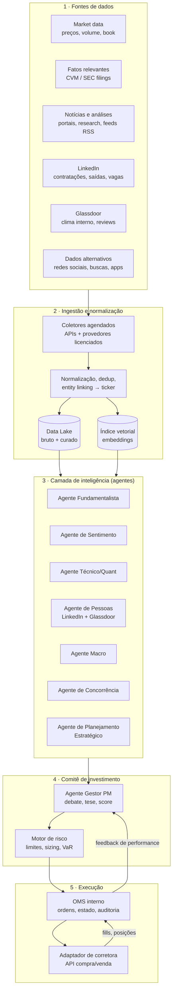

# Projeto: AI-Native Hedge Fund

> **Status:** Documento de projeto (design). Nada aqui foi construído — este arquivo define visão, arquitetura, componentes, fluxos, stack sugerida, riscos e roadmap para uma futura implementação.

---

## 1. Visão e objetivo

Um fundo de investimento **AI-native**: a inteligência artificial não é uma ferramenta auxiliar, mas o núcleo do processo de investimento. O sistema:

1. **Consome conteúdo diariamente** de dezenas de fontes — dados de mercado, análises de research, notícias, fatos relevantes (CVM/SEC), LinkedIn, Glassdoor, redes sociais e dados alternativos.
2. **Interpreta sinais de mercado** cruzando informações estruturadas (preço, volume, fundamentos) com não estruturadas (texto, sentimento, movimentação de pessoas).
3. **Acompanha empresas, mercados e concorrentes** de forma contínua, mantendo uma "memória" viva por ativo.
4. **Decide estratégias de compra e venda de ações** por meio de um comitê de agentes de IA, com gestão de risco automatizada e supervisão humana configurável.
5. **Executa ordens** via API de corretora, com trilha de auditoria completa de cada decisão.

### Princípios AI-native

- **Toda informação vira sinal**: cada dado ingerido é normalizado, indexado (embeddings) e associado a um ou mais tickers.
- **Decisão explicável**: nenhuma ordem é enviada sem uma tese escrita pelo agente, com as evidências que a sustentam.
- **Humano no circuito (configurável)**: modos *autônomo*, *aprovação por alçada* (ordens acima de X exigem OK humano) e *somente sugestão*.
- **Backtest antes de produção**: toda estratégia roda em simulação e paper trading antes de tocar dinheiro real.

---

## 2. Arquitetura macro



---

## 3. Camada de fontes e ingestão

### 3.1 Fontes previstas

| Categoria | Exemplos | Forma de acesso |
|---|---|---|
| Market data | B3, NYSE/NASDAQ — preços EOD e intraday, volume | APIs: Alpaca, Polygon.io, Yahoo Finance, Cedro/Comdinheiro (BR) |
| Fatos relevantes / filings | CVM (RAD/Empresas.NET), SEC EDGAR | Portais públicos com feed estruturado (gratuitos) |
| **Canais oficiais da empresa** | Site institucional, site/central de RI (releases de resultados, apresentações, transcrições de calls, guidance), notícias e press releases oficiais, blog e perfis oficiais da companhia | Monitoramento direto com **detecção de mudança** (diff do conteúdo — alteração silenciosa em página de RI ou de produto também é sinal); RSS quando houver |
| **Portais de notificação judicial** | Ações e litígios em que a empresa (e seus peers, §4.4) se envolva, como autora ou ré: trabalhista, fiscal, cível, regulatório, societário, ambiental — novas ações, andamentos e decisões | CNJ (DataJud, Comunica/DJEN — diário de justiça eletrônico nacional), consulta processual dos tribunais (TJs, TRFs, TRTs, TST, STJ, STF), diários de justiça; agregadores comerciais (Jusbrasil, Escavador, Digesto) para busca por CNPJ e alertas; PACER para empresas com exposição aos EUA |
| Notícias e análises | Valor, InfoMoney, Bloomberg, Reuters, relatórios de research, RSS | APIs de notícias (NewsAPI, GNews), assinaturas, RSS |
| **Portais de notícia nacionais e regionais** | Cobertura ampla: portais nacionais + **portais regionais da região de sede e operações de cada empresa** (mesmo mapa georreferenciado dos portais de governo). Critério de captura deliberadamente largo: qualquer notícia que guarde **qualquer relação** com a empresa, com o mercado, com a economia ou com regulamentações/legislações que possam afetar o negócio **direta ou indiretamente** — a triagem fina é feita depois, pelo classificador de relevância (§3.2) | RSS/APIs dos portais; jornais regionais e locais das praças relevantes |
| LinkedIn | Vagas abertas, contratações de executivos, saídas em massa | **Somente via provedores licenciados** (ex.: Coresignal, Bright Data datasets, Revelio Labs) — scraping direto viola os termos de uso |
| Glassdoor | Nota da empresa, tendência de reviews, sentimento sobre liderança | Provedores de dados agregados (mesma restrição acima) |
| Dados alternativos | X/Twitter, Reddit, Google Trends, downloads de apps | APIs oficiais e provedores especializados |
| Dados econômicos (2 camadas, §4.3) | Setoriais específicos por área de atuação (peso maior, 10 anos) + economia mundial como um todo (peso menor, **30 anos**) | BCB/SGS, IBGE, ONS/ANEEL, CONAB, ANP; FMI, Banco Mundial, OCDE, BIS, FRED |
| **Portais oficiais de governo** (3 esferas) | Notícias e atos oficiais: federal (gov.br, Agência Brasil, DOU), **estadual e municipal — especialmente das localidades onde cada companhia é sediada e tem operações relevantes**: diários oficiais, portais de secretarias (fazenda, meio ambiente, infraestrutura), agências estaduais | Portais públicos e diários oficiais (gratuitos, com feed/raspagem permitida por serem dados públicos governamentais) |

### 3.2 Pipeline de ingestão

1. **Coletores agendados** (cron por fonte, com frequência própria: intraday para preço, diário para notícias/reviews, semanal para LinkedIn/Glassdoor) — e, no onboarding de cada ticker, o **backfill obrigatório de 10 anos** (trimestres + fatos relevantes + preços, §4.2).
   - **Monitoramento governamental georreferenciado**: no onboarding, cada companhia é cadastrada com sede (município/UF) e localidades de operações relevantes (plantas, minas, CDs); o pipeline assina automaticamente os portais oficiais e diários das três esferas correspondentes — federal sempre, estadual e municipal conforme o mapa de presença da empresa. Sinais típicos: mudança tributária local (ICMS, ISS), licenciamento ambiental, licitações e concessões, incentivos fiscais, obras de infraestrutura que afetam a operação.
2. **Normalização**: tudo vira um `SignalDocument` padrão — `{fonte, timestamp, tickers[], tipo, texto, metadados, url}`.
3. **Entity linking**: NER + dicionário de empresas para mapear "a varejista de Cascavel" → ticker correto; um documento pode afetar vários tickers (empresa + concorrentes).
4. **Classificador de relevância e canal de impacto** (a contrapartida necessária da captura ampla): todo documento recebe (a) **tipo de relação** — menção direta à empresa · setor/concorrentes · economia/mercado · regulamentação/legislação · **litígios/judicial**; (b) **direção do impacto** — direto ou indireto, e quais tickers afeta (via setor e via mapa geográfico de sede/operações — ex.: lei estadual nova afeta as empresas com operação naquele estado); (c) **score de relevância** que prioriza a fila dos agentes; (d) **datação dupla — evento vs. decisão**: além da data de publicação, o classificador estima a **data do fato gerador**. Uma inauguração de fábrica noticiada hoje materializa uma decisão de capital tomada anos atrás — diz pouco sobre o momento atual da companhia; um anúncio de investimento aprovado hoje é decisão presente. Os agentes leem o "momento da companhia" pelo **fluxo de decisões recentes**, não pela materialização de decisões antigas, e a memória por ativo mantém a **linha do tempo decisão → anúncio → execução → entrega** de cada movimento relevante (é essa linha que alimenta o histórico promessa×entrega do Agente de Planejamento Estratégico). Nada é descartado — documento de baixa relevância fica indexado e pesquisável (a memória por ativo o recupera se virar padrão), mas só o que passa do limiar entra no ciclo diário de análise. O limiar é calibrado pela atribuição de performance: se sinais de origem regional/regulatória provarem valor, o peso sobe.
5. **Deduplicação** por hash semântico (a mesma notícia replicada em 10 portais conta uma vez).
6. **Armazenamento duplo**: bruto no data lake (reprocessável) e curado no banco relacional + índice vetorial para busca semântica pelos agentes.

---

## 4. Camada de inteligência — os agentes

Cada agente é um LLM com prompt, ferramentas e memória próprios. Rodam no ciclo diário e sob demanda (quando chega um fato relevante, por exemplo).

| Agente | Insumos | Saída |
|---|---|---|
| **Fundamentalista** | Balanços, fatos relevantes, guidance, múltiplos | Avaliação da tese fundamentalista por ativo (score −5..+5 + justificativa) |
| **Sentimento** | Notícias, redes sociais, análises de terceiros | Índice de sentimento por ativo e por setor, com detecção de mudança de tendência |
| **Técnico/Quant** | Séries de preço/volume, indicadores, fatores | Sinais técnicos e de fatores (momentum, valor, qualidade) |
| **Pessoas (LinkedIn+Glassdoor)** | Fluxo de contratações/saídas, vagas por área, reviews | Sinais antecedentes: êxodo de engenheiros, contratação agressiva em nova linha de negócio, queda de moral pré-resultado |
| **Macro** | As duas camadas econômicas do §4.3: painéis setoriais (peso maior) e economia mundial (peso menor) — juros, câmbio, commodities, calendário econômico | Regime de mercado (risk-on/risk-off) que condiciona o apetite do comitê + leitura do vento setorial (a favor/contra) para cada setor coberto |
| **Concorrência** | **Cobertura espelhada dos concorrentes relevantes (§4.4)** — mesmos dados e análises replicados para cada peer | **Desempenho relativo** da empresa no mercado em que atua: quartil em cada KPI setorial vs. peers, evolução de share, quem ganha/perde — só emite sinal se o peer set estiver coberto |
| **Planejamento Estratégico** | Planos estratégicos divulgados, guidance de longo prazo, M&A, alocação de capital (capex, recompras, dividendos), investor days | Avaliação da **qualidade da estratégia e da execução** de cada empresa: coerência plano×entrega (guidance cumprido?), disciplina de alocação de capital, vantagem competitiva sustentável (VRIO), e **análise de cenários** por ativo (o que quebra ou confirma a tese em cada cenário macro/setorial) |

Cada saída é um **sinal versionado e auditável**: `{agente, ticker, score, confiança, evidências[], timestamp}`.

### 4.1 Pré-requisito de cobertura: o Dossiê Setorial (bloqueante)

**Regra do sistema: nenhuma empresa é analisada sem uma base teórica forte e aprovada sobre o seu mercado de atuação.** Isso é formalizado no artefato **Dossiê Setorial** — condição de entrada de qualquer ticker no universo analisável.

**Conteúdo mínimo de cada dossiê:**

1. **Economia do setor** — como se ganha dinheiro nele: drivers de receita, estrutura de custos, margens típicas, intensidade de capital, ciclo e sazonalidade.
2. **Estrutura competitiva** — Cinco Forças aplicadas ao setor, barreiras de entrada, dinâmica de consolidação, mapa dos players.
3. **KPIs setoriais** — as métricas que realmente importam e seus benchmarks (ex.: NIM e índice de Basileia para bancos; same-store sales para varejo; EBITDA/tonelada para mineração; churn e ARPU para telecom) — impede o agente de avaliar um banco com métrica de varejista.
4. **Regulação** — órgão regulador, regras que movem o setor, agenda regulatória em curso.
5. **Riscos estruturais** — disrupção tecnológica, transição energética, dependências de commodity/câmbio.
6. **Bibliografia setorial confiável** — fontes que passam no critério de confiabilidade da `FUNDAMENTACAO-TEORICA.md` §1 (academia, reguladores, dados oficiais), com as fontes duvidosas explicitamente excluídas.
7. **Painel de indicadores econômicos setoriais** — as séries econômicas específicas do setor, com 10 anos de histórico carregado e pesos definidos (ver §4.3).

**Ciclo de vida:** o dossiê é redigido por um processo dedicado de curadoria (agente pesquisador + fontes verificadas), **revisado e aprovado por humano**, versionado no banco, e revalidado periodicamente (anual, ou imediatamente após mudança regulatória/estrutural relevante). Estados: `rascunho → em_revisão → aprovado → vencido`.

**Enforcement (regra dura, em dois pontos):**
- **Pipeline de análise**: agentes não emitem sinal para ticker cujo setor não tem dossiê `aprovado` — o dossiê é injetado no contexto de cada agente ao analisar o ativo.
- **Motor de risco**: nenhuma ordem é aprovada para ativo sem dossiê setorial válido (invariante testada como as demais).

Efeito prático: expandir o universo de ativos tem custo deliberado — cobrir um setor novo exige primeiro construir e aprovar a base teórica dele. É lentidão intencional: o sistema nunca opera o que não entende.

### 4.2 Pré-requisito de profundidade histórica: mínimo de 10 anos (bloqueante)

> **Convenção do projeto:** salvo indicação explícita em contrário, "base histórica" significa sempre **10 anos**, em qualquer documento deste projeto — **exceto para dados globais** (economia mundial e séries internacionais da camada 2 do §4.3), cuja base histórica é sempre de **30 anos**.

Segundo pré-requisito de entrada no universo analisável: **base histórica mínima de 10 anos por empresa**, com três componentes obrigatórios e completos:

| Componente | Conteúdo exigido | Fonte primária |
|---|---|---|
| **Demonstrações trimestrais** | **Todos os trimestres** dos últimos 10 anos (≥ 40 trimestres: balanço, DRE, fluxo de caixa, notas) — sem lacunas | CVM (ITR/DFP via dados abertos) para B3; SEC EDGAR (10-Q/10-K) para EUA |
| **Fatos relevantes** | **Histórico completo** de fatos relevantes e comunicados ao mercado dos últimos 10 anos, com data/hora original | CVM (sistema IPE/RAD Empresas.NET); SEC (8-K) |
| **Dados de mercado** | Preço e volume diários (ajustados por proventos) cobrindo o mesmo período | B3/provedores; APIs de market data |

**Por que 10 anos:** cobre mais de um ciclo econômico completo (no Brasil: recessão 2015–16, pandemia 2020, ciclos de juros de alta e de baixa), dá amostra suficiente para o walk-forward do backtest (calibração + validação fora da amostra), e permite ao agente comparar o comportamento da empresa em crise vs. bonança — inclusive a coerência histórica entre o que a empresa anunciou em fatos relevantes e o que entregou nos trimestres seguintes (insumo direto do Agente de Planejamento Estratégico).

**Enforcement (mesmo padrão do §4.1):**
- **Carga retroativa (backfill)** é etapa obrigatória do onboarding de cada ticker; um check automático de completude (≥ 40 trimestres sem lacuna + série de fatos relevantes íntegra + preços contínuos) muda o estado do ativo para `histórico_completo`.
- Agentes não emitem sinal e o motor de risco não aprova ordem para ativo sem `histórico_completo` (invariante testada).
- **IPOs e empresas com menos de 10 anos de listagem ficam fora do universo por padrão.** Exceção somente por aprovação humana explícita e documentada, com limite de posição reduzido — e o motivo registrado na tese.
- A janela é **móvel**: a cada trimestre, o pipeline incorpora o novo ITR e os novos fatos relevantes; falha de atualização por 2 trimestres consecutivos rebaixa o ativo para fora do universo até regularizar.

### 4.3 Base de dados econômicos: duas camadas com pesos distintos (setorial: 10 anos · global: 30 anos)

Terceiro componente obrigatório da base de dados — o contexto econômico em que cada empresa opera, com hierarquia de peso explícita e profundidades distintas por camada (convenção do §4.2: 10 anos como padrão, 30 anos para dados globais):

**Camada 1 — Dados econômicos setoriais (peso maior).** Indicadores **detalhados e específicos da área de atuação de cada empresa**, definidos no Dossiê Setorial do setor (que passa a incluir um *painel de indicadores obrigatório*). Exemplos do padrão:

| Setor | Painel setorial (exemplos) | Fontes |
|---|---|---|
| Bancos | Saldo e concessões de crédito, inadimplência por segmento, spread bancário, Selic | BCB (SGS, IF.data) |
| Varejo | PMC (volume de vendas), confiança do consumidor, massa salarial, endividamento das famílias | IBGE, FGV, BCB |
| Mineração/Siderurgia | Preço do minério e do aço, produção industrial da China, frete marítimo | Bolsas de commodities, NBS/China, USGS |
| Agronegócio | Preços de grãos/proteína, safras e estoques, câmbio, clima | CONAB, USDA, CEPEA |
| Energia elétrica | Carga do sistema, nível de reservatórios, tarifas, PLD | ONS, ANEEL, EPE, CCEE |
| Óleo & gás | Brent/WTI, produção e demanda global, capacidade de refino | ANP, IEA, EIA |

**Camada 1b — Mercados atendidos pela empresa (peso proporcional à receita; base histórica de 10 anos).** Não basta entender onde a empresa está sediada — é preciso entender **para onde ela vende**. No onboarding, o **mapa de receita por geografia** é extraído das demonstrações (notas explicativas de receita por segmento/região) e do material de RI; todo mercado que responda por **≥ 10% da receita** (ou seja estratégico declarado pela administração) ganha painel próprio de acompanhamento. Exemplo do requisito: uma empresa que vende muito para **Angola** precisa de base sobre o mercado angolano — PIB e demanda local do setor, câmbio (kwanza), inflação, risco político e cambial, regras de comércio (tarifas, cotas, restrições de remessa), fontes FMI/Banco Mundial/banco central local — mais a assinatura de **notícias e atos oficiais daquele mercado** no pipeline de ingestão. Vale para mercados externos e domésticos (empresa com receita concentrada no Nordeste precisa do painel regional correspondente). **Peso na hierarquia:** entre o setorial e o global, proporcional à participação do mercado na receita. O mapa de receita é revisado a cada trimestre (janela móvel, junto com o ITR).

**Camada 2 — Dados globais da economia mundial (peso menor, nunca zero; base histórica de 30 anos).** O pano de fundo comum a todos os ativos: PIB global e por bloco, juros dos principais bancos centrais (Fed, BCE, BoJ), inflação global, comércio internacional, índice dólar (DXY), commodities agregadas, indicadores de estresse financeiro (VIX, spreads de crédito). Fontes: FMI (WEO), Banco Mundial, OCDE, BIS, FRED — todas com séries longas disponíveis. **Por que 30 anos na camada global:** ciclos globais são mais longos e raros que os domésticos; 30 anos capturam múltiplos regimes completos (crise asiática 1997, bolha ponto-com 2000, crise financeira 2008, pandemia 2020, choque inflacionário 2021–23), dando ao Agente Macro repertório de comparação que 10 anos não dão.

**Regra de ponderação (explícita nos prompts e na agregação de sinais):** para a análise de uma empresa, vale a hierarquia **setorial > mercados atendidos (proporcional à receita) > doméstico > global** — o dado específico do setor domina; o dado global entra como condicionante de regime (via Agente Macro), com peso reduzido, mas nunca é descartado: choques globais atravessam qualquer setor (2008, 2020). A calibração fina dos pesos por setor é definida no dossiê e revisada pela atribuição de performance.

**Enforcement (mesmo padrão dos §4.1–4.2):**
- O Dossiê Setorial só chega ao estado `aprovado` se o seu painel de indicadores setoriais estiver definido **e carregado com 10 anos de histórico**.
- A base global é pré-requisito único do sistema (não por ativo): carregada no bootstrap, atualizada no ciclo diário/mensal conforme a frequência de cada série, com check de frescor — série global vencida degrada o Agente Macro para "regime indefinido" (postura conservadora), não bloqueia o universo inteiro.

### 4.4 Cobertura espelhada de concorrentes: análise relativa obrigatória

**Toda análise feita para uma empresa do universo é replicada para os seus concorrentes de relevância** — o objetivo não é saber se a empresa é boa em absoluto, mas **qual o desempenho dela no mercado em que atua**. Sem os peers analisados da mesma forma, não há como responder.

- **Definição do peer set no onboarding:** os concorrentes relevantes de cada empresa são identificados no Dossiê Setorial (que já mapeia os players) por participação de mercado e sobreposição de produto/geografia, e registrados em `assets` (campo já existente de pares/concorrentes, agora com papel formal).
- **Replicação integral, no que for aplicável:** os mesmos coletores (notícias nacionais/regionais, canais oficiais, portais de governo, dados de pessoas), os mesmos painéis, a mesma datação temporal e os mesmos agentes rodam para cada peer.
- **Dois tipos de peer:**
  - `investível` — listado e dentro do escopo de execução: cobertura integral, mesmos pré-requisitos (§4.1–4.3); pode inclusive virar posição (comprar o vencedor do setor em vez da empresa originalmente analisada — ou um par long/short);
  - `referência` — empresa fechada, estatal não listada ou listada fora do escopo: cobertura adaptada ao que existe publicamente (demonstrações quando houver, notícias, vagas/reviews), **com as lacunas documentadas** para o comitê saber o que não está sendo visto.
- **Saída formal — desempenho relativo:** para cada KPI setorial do dossiê, a posição da empresa vs. peers (quartil, tendência de 10 anos), evolução de market share e comparação dos sinais de pessoas e de execução (promessa×entrega). **Toda tese registra a posição relativa** — deixa explícito se o fundo está comprando o melhor operador do setor, o mais barato, ou o azarão de virada.
- **Enforcement:** o Agente de Concorrência não emite sinal para empresa cujo peer set não esteja coberto; peer set vazio ou desatualizado (não revisado na última revalidação do dossiê) bloqueia o sinal de concorrência e rebaixa a confiança agregada da tese.

### 4.5 Motor 2: entrada em mercado novo é avaliada separadamente

Quando uma empresa do universo **entra em um mercado novo** — diversificação, nova vertical, nova geografia relevante, aquisição fora do setor de origem — esse negócio é tratado como o **Motor 2** da companhia e avaliado **separadamente** do negócio principal (Motor 1). Misturar o negócio maduro com a aposta nova contamina os dois: o Motor 2 pequeno some nos números consolidados, e o risco dele não aparece na média.

Regras da avaliação segregada:

1. **Dossiê setorial próprio:** o mercado do Motor 2 exige Dossiê Setorial aprovado do setor **novo** (o §4.1 aplica-se integralmente — o sistema não avalia a nova frente sem base teórica daquele mercado).
2. **Peer set próprio:** os concorrentes do Motor 2 são os players do mercado novo (não os do negócio principal), com a cobertura espelhada do §4.4.
3. **KPIs e acompanhamento próprios:** métricas do setor novo, metas declaradas pela administração para a nova frente, e linha promessa×entrega **por motor** (a empresa pode estar executando bem o core e mal a expansão — ou o contrário).
4. **Tese em soma das partes:** a avaliação final compõe Motor 1 + Motor 2 + custo/risco da transição — usando Ansoff e Hamel & Prahalad (distância da competência central precifica o risco de execução) e Christensen (o Motor 2 é ataque disruptivo ou defesa?) — com cenários separados por motor.
5. **Gatilho automático:** fato relevante ou ITR indicando novo segmento de receita, nova geografia relevante ou aquisição fora do setor dispara a criação do Motor 2 no sistema (estado `motor2_pendente` até o dossiê do novo setor ser aprovado — enquanto isso, a tese registra a nova frente como risco não avaliado, com desconto de confiança).

---

## 5. Comitê de investimento (decisão)

O **Agente Gestor (PM)** consolida os sinais em decisões:

1. **Rodada de debate**: para os ativos com sinais fortes ou divergentes, o PM confronta os agentes (padrão multi-agente adversarial — um agente "advogado do diabo" tenta derrubar a tese).
2. **Tese escrita**: toda decisão gera um documento — o que comprar/vender, por quê, quais evidências, qual o gatilho de saída, qual o risco que invalida a tese. Os cenários do Agente de Planejamento Estratégico entram aqui: cada tese declara em quais cenários ela sobrevive e qual evento a invalida.
3. **Score final** por ativo → lista-alvo de portfólio (pesos desejados).
4. O delta entre portfólio-alvo e posição atual vira **propostas de ordem**.

### Motor de risco (veto e dimensionamento)

Camada determinística (não-LLM, regras duras) que valida cada proposta:

- Limites por posição (ex.: máx. 10% do PL em um ativo), por setor e de exposição bruta/líquida.
- Position sizing por volatilidade (risk parity simplificado / Kelly fracionado).
- Stop-loss e take-profit obrigatórios por posição, definidos na tese.
- VaR e drawdown máximo do portfólio; **circuit breaker**: acima do limite, o sistema só reduz risco, nunca aumenta.
- Filtro de liquidez (não montar posição maior que X% do volume médio diário).
- Alçadas: ordens acima de um valor exigem aprovação humana (notificação push/e-mail com a tese anexa).

---

## 6. Execução — API de compra e venda

### 6.1 Abstração `BrokerAdapter`

Interface única para que a troca de corretora não afete o resto do sistema:

```
BrokerAdapter
├── get_positions() / get_balance()
├── place_order(ticker, side, qty, type, limit_price?, stop?)
├── cancel_order(order_id)
├── get_order_status(order_id)
└── stream_fills(callback)
```

### 6.2 Corretoras candidatas

| Mercado | Opção | Observações |
|---|---|---|
| EUA | **Alpaca** | API-first, paper trading nativo, ideal para MVP |
| EUA/global | **Interactive Brokers** | Mais completa (ações BR via ADR, opções, FX); API mais complexa |
| Brasil | **MetaTrader 5** via corretoras que o suportam | Caminho mais viável para B3 no varejo |
| Brasil | DMA/FIX direto na B3 | Só faz sentido em estágio institucional (custo alto) |

**Recomendação para o MVP**: começar com **Alpaca em paper trading** (custo zero, API limpa), validar o ciclo completo, e só então plugar corretora real / mercado brasileiro.

### 6.3 OMS interno

Registro próprio de todas as ordens e posições (não confiar só na corretora): estado de cada ordem, fills parciais, reconciliação diária com a corretora, e trilha de auditoria ligando **ordem → tese → sinais → documentos-fonte**.

---

## 7. Fluxo diário (linha do tempo)

| Horário (BRT) | Etapa |
|---|---|
| 05:00 | Coleta noturna: notícias, filings, dados de fechamento global, atualização semanal de LinkedIn/Glassdoor quando aplicável |
| 06:00 | Normalização, dedup, embeddings; atualização da memória por ativo |
| 06:30 | Agentes analistas rodam em paralelo e publicam sinais |
| 07:30 | Comitê: PM consolida, debate os casos divergentes, escreve/atualiza teses |
| 08:30 | Motor de risco valida propostas → fila de ordens do dia (e pedidos de aprovação humana, se houver) |
| 10:00–17:00 | Execução com algoritmo simples (TWAP/limites); monitor intraday reage a fatos relevantes novos |
| 18:00 | Reconciliação com a corretora; cálculo de P&L |
| 18:30 | **Relatório diário**: posições, resultado, decisões do dia com teses, sinais novos — enviado ao gestor humano |

O monitor intraday é orientado a eventos: um fato relevante ou notícia de alto impacto dispara reavaliação imediata do ativo, fora do ciclo.

---

## 8. Modelo de dados (núcleo)

- `assets` — tickers, setor, pares/concorrentes (peer set formal do §4.4, com tipo `investível`/`referência`), metadados, vínculo ao dossiê setorial, **sede (município/UF) e localidades de operações relevantes** (mapa que dirige o monitoramento de portais oficiais estaduais/municipais) e **mapa de receita por geografia/mercados atendidos** (§4.3 camada 1b, revisado a cada ITR), além dos canais oficiais da companhia (site, RI) monitorados com diff.
- `business_engines` — motores da companhia (§4.5): Motor 1 (core) e Motor 2+ (novas frentes), cada um com setor/dossiê, peer set, KPIs, metas declaradas e linha promessa×entrega próprios.
- `legal_cases` — litígios por empresa (CNPJ): tipo (trabalhista, fiscal, cível, regulatório, societário, ambiental), polo (autora/ré), fase, valor da causa, andamentos e desfecho — com agregados por tipo/período (o **fluxo de novas ações** é o sinal: salto anormal de ações trabalhistas antecipa problema operacional antes do balanço) e **cruzamento com as provisões e contingências das notas explicativas** (empresa provisionando muito menos que o passivo judicial observado é red flag do Agente Fundamentalista).
- `sector_dossiers` — dossiês setoriais versionados (conteúdo, bibliografia, estado de aprovação, validade) — pré-requisito de análise (§4.1).
- `fundamentals_quarterly` — demonstrações trimestrais normalizadas por ativo (≥ 40 trimestres, §4.2), com check de completude.
- `material_facts` — arquivo integral de fatos relevantes por ativo (≥ 10 anos, com timestamp original), vinculado aos `signal_documents`.
- `econ_series` — séries econômicas das duas camadas do §4.3 (setoriais: 10 anos; globais: 30 anos), com fonte, frequência, peso e check de frescor.
- `signal_documents` — todo conteúdo ingerido, normalizado, com vínculo a ativos.
- `signals` — saídas dos agentes (score, confiança, evidências → documentos).
- `theses` — teses de investimento versionadas (aberta, atualizada, invalidada, encerrada).
- `orders` / `fills` / `positions` — OMS.
- `portfolio_snapshots` — foto diária para P&L e atribuição de performance.
- `agent_runs` — log de cada execução de agente (prompt, custo, latência) para auditoria e melhoria.

---

## 9. Stack tecnológica sugerida

| Camada | Sugestão |
|---|---|
| Linguagem | Python (ecossistema financeiro + IA) |
| Orquestração de pipelines | Prefect ou Airflow; eventos via fila (Redis Streams / SQS) |
| Agentes de IA | Claude API (Agent SDK) — agentes com ferramentas, saída estruturada e citação de evidências |
| Banco relacional | PostgreSQL |
| Índice vetorial | pgvector (simples, mesmo Postgres) |
| Data lake | S3 + Parquet |
| Backtesting | vectorbt ou backtrader; simulador próprio para a camada de decisão por agentes |
| Execução | Alpaca SDK (MVP) atrás do `BrokerAdapter` |
| Observabilidade | Grafana + logs estruturados; alertas por Telegram/e-mail |
| Painel do gestor | Web app simples (Next.js ou Streamlit): portfólio, teses, aprovações pendentes, P&L |

---

## 10. Backtesting e validação

1. **Replay histórico**: reprocessar o pipeline com dados de datas passadas, com corte temporal rígido (o agente só vê o que existia até aquele dia — cuidado com look-ahead bias inclusive no conhecimento do LLM).
2. **Paper trading** por no mínimo 60–90 dias antes de capital real.
3. **Métricas**: Sharpe, Sortino, drawdown máximo, hit rate por agente (qual agente acerta mais?), custo de transação simulado.
4. **Atribuição por agente**: medir a contribuição de cada tipo de sinal ao resultado — é o mecanismo de melhoria contínua do comitê.

---

## 11. Compliance e aspectos legais (crítico)

- **Gestão de recursos de terceiros exige autorização da CVM** (registro de gestora, Resolução CVM 21) e estrutura de fundo (Resolução CVM 175). Para **capital próprio**, o sistema pode operar como pessoa física/PJ investindo, sem registro de gestora.
- **LinkedIn e Glassdoor proíbem scraping direto** nos termos de uso. O projeto deve usar **provedores de dados licenciados** (Revelio Labs, Coresignal etc.) ou APIs oficiais — nunca scraping próprio dessas plataformas.
- **LGPD**: dados de pessoas (ex.: movimentação de executivos) devem ser tratados de forma agregada e com base legal adequada.
- **Somente informação pública**: o pipeline deve ter salvaguarda explícita contra uso de informação material não pública (insider trading é crime — Lei 6.385/76 art. 27-D).
- **Trilha de auditoria completa**: toda ordem rastreável até as fontes que a motivaram (também é proteção regulatória).

---

## 12. Custos estimados de operação (ordem de grandeza, mensal)

| Item | Faixa |
|---|---|
| APIs de LLM (agentes, ~50–200 ativos cobertos) | US$ 300 – 2.000 |
| Market data (tempo real ou EOD premium) | US$ 0 (EOD gratuito) – 500 |
| Dados LinkedIn/Glassdoor licenciados | US$ 500 – 5.000 (é o item mais caro; no MVP, começar sem ou com amostras) |
| Notícias/research | US$ 0 – 500 |
| Infraestrutura (cloud) | US$ 100 – 400 |

---

## 13. Roadmap em fases

**Fase 1 — Fundação (4–6 semanas)**
Pipeline de ingestão (market data + notícias + fatos relevantes CVM/EDGAR), modelo de dados, 2 agentes (Fundamentalista e Sentimento), relatório diário por e-mail. *Nenhuma ordem — só leitura e sinais.*

**Fase 2 — Comitê e simulação (4–6 semanas)**
Agentes Técnico e Macro, Agente PM com teses escritas, motor de risco, backtest com replay histórico, início do paper trading via Alpaca.

**Fase 3 — Sinais alternativos (4 semanas)**
Integração de provedor licenciado de dados LinkedIn/Glassdoor, Agente de Pessoas e de Concorrência, monitor intraday orientado a eventos.

**Fase 4 — Capital real (contínuo)**
Após 60–90 dias de paper trading com métricas aceitáveis: capital próprio pequeno, alçadas de aprovação humana ativas, painel do gestor, atribuição de performance por agente e ciclo de melhoria contínua.

---

## 14. Principais riscos do projeto

| Risco | Mitigação |
|---|---|
| Alucinação do LLM em análise financeira | Saída estruturada com evidências obrigatórias; motor de risco determinístico com poder de veto; debate adversarial |
| Look-ahead bias no backtest | Corte temporal rígido nos dados; validação só com paper trading em tempo real |
| Custo/indisponibilidade de dados de LinkedIn/Glassdoor | Tratar como sinal complementar (Fase 3), nunca como dependência do núcleo |
| Overtrading / custos de transação | Limite de giro mensal no motor de risco; decisões diárias, não intraday, como padrão |
| Risco regulatório (gestão de terceiros) | Operar apenas capital próprio até haver estrutura CVM |
| Falha de execução (API da corretora fora) | OMS com reconciliação, circuit breaker e kill switch manual |

---

*Documento de projeto — v1. Próximo passo sugerido: validar a Fase 1 do roadmap e escolher o universo inicial de ativos (ex.: 30 ações do Ibovespa ou S&P 100).*
